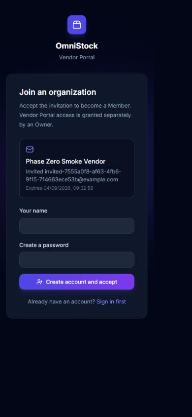

# Vendor Portal member invitations and access

## Purpose

This stage lets an Organization Owner bring collaborators into the Vendor Portal without making
each collaborator a separate vendor. Organization membership and Vendor Portal access are kept as
two distinct decisions: accepting an invitation creates membership, while an Owner explicitly
grants or revokes access to the subscribed portal.

That separation keeps the release simple for small producers and still supports organizations that
later subscribe to more portals. It also prevents a future inventory or fiscal entitlement from
being inferred merely because a person belongs to the Organization.

## User experience

Owners see **Team Access** in desktop and mobile navigation. The page provides:

- the current member list and each member's Vendor Portal access state;
- invitation creation for the supported `member` role;
- resend and cancel actions for pending invitations;
- explicit Vendor Portal access grant and revoke controls;
- immutable, implicit access for Owners; and
- loading, empty, failure, expired-invitation, and revoked-access guidance.

The navigation item is hidden from non-Owners, and the API remains the authority if a user reaches
the route directly. An Organization switcher remains available on blocked-access screens when the
user has another Organization they can enter.

## Invitation lifecycle

Invitation emails link to `/accept-invitation?invitationId=...`. A high-entropy invitation identifier
can be exchanged for a deliberately limited public summary containing the invited email,
Organization name, inviter email, role, state, and expiry. The endpoint is covered by the API's
general rate limiter and does not expose member lists, subscriptions, profiles, or other Organization
data.

The recipient can then:

1. sign in to an existing account and return to the invitation;
2. create an account using the invited email and accept the invitation; or
3. see a recoverable message when the invitation is invalid, expired, already used, or belongs to a
   different signed-in email.

After acceptance, the new Organization becomes active and the frontend refreshes its platform
context. Membership does not itself bypass the Vendor Portal access check. The compatibility login
facade also supports invited Better Auth users who do not have a legacy `Vendor` record.

## Security and tenancy

- Only an authenticated Organization Owner may list members, manage invitations, or change access.
- Member access updates are scoped to the active Organization and reject Owners because their access
  is implicit.
- Access changes require an active Vendor Portal subscription.
- The last-Owner protections remain in Better Auth's Organization layer.
- Return URLs accept only same-origin absolute paths; external and protocol-relative redirects are
  rejected.
- Invitation acceptance uses Better Auth's session and Organization APIs, including invited-email
  validation.
- The public summary is read-only, rate-limited, and addressed by the unguessable invitation token.

## Verification

The stage is covered by component tests for Owner-only navigation, access revocation, invitation
resend, Organization activation, expired invitations, and safe MFA/return routing. API tests cover
public invitation summaries, unknown-token behavior, Owner access protection, subscription checks,
and cross-Organization member targeting.

Production builds and TypeScript checks cover both new routes. Browser verification covers the
signed-out acceptance view at desktop and mobile widths without creating an account or consuming an
invitation.

## Rollback

The frontend can be rolled back independently by removing the Team Access and invitation routes.
No membership or access data is deleted. The public summary endpoint can remain during a frontend
rollback because it is read-only and exposes only invitation-token-scoped data; remove it after all
deployed invitation links no longer depend on it. Do not delete Better Auth members, invitations, or
`MemberPortalAccess` records as part of an application rollback.

## Deferred work

Custom Organization roles, granular permissions, inventory-specific job roles, profile switching,
billing, and additional portal subscriptions remain outside the Vendor Portal release.
