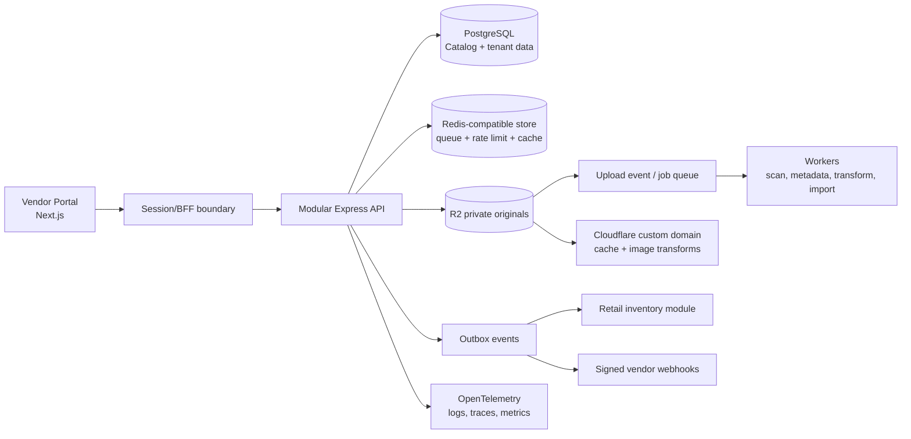
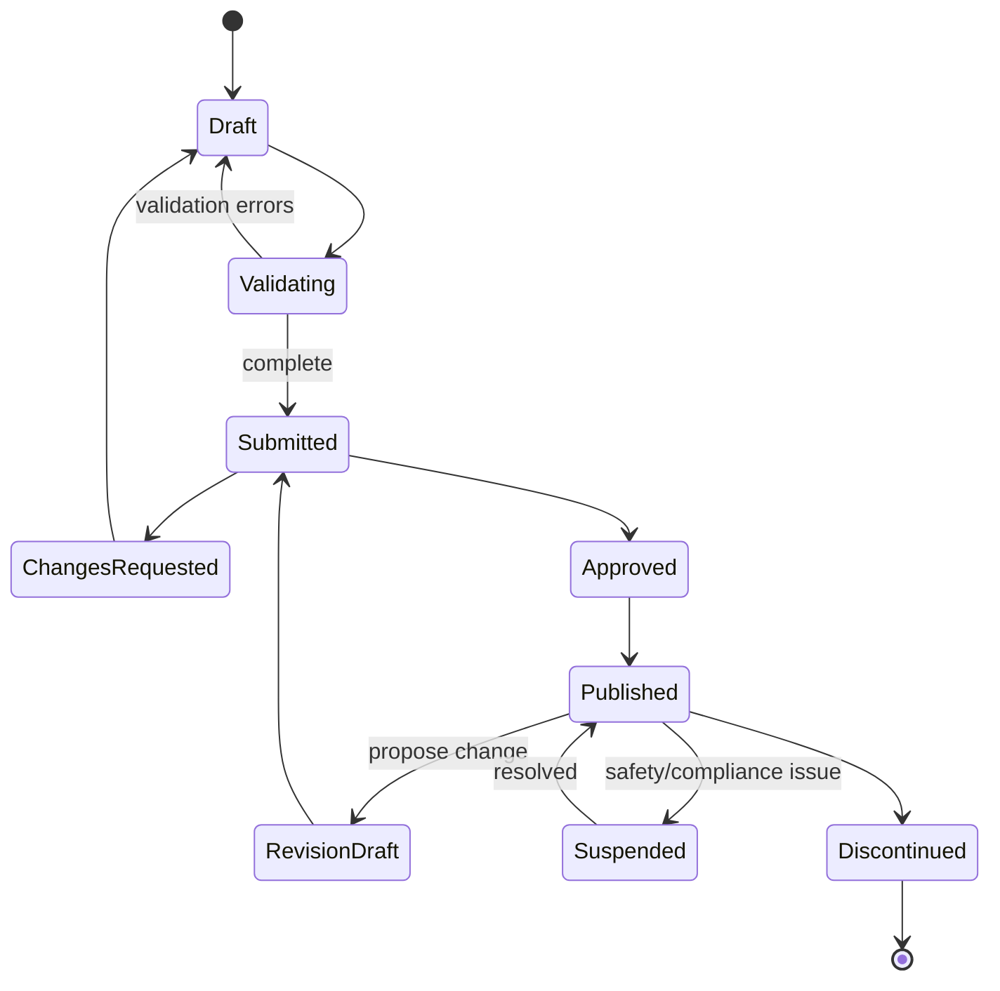

# Vendor Portal Implementation Blueprint

**Status:** Phase 0 implemented in the repository; Phase 1+ proposed  
**Reviewed:** 2026-08-25  
**Scope:** Vendor/producer portal, shared product catalog, and its integration boundary with the multi-location inventory platform  
**Repository baseline:** Next.js vendor portal + Express API + PostgreSQL/Prisma monorepo

## 1. Executive summary

The repository already contains the outline of a usable vendor portal: registration and login, a dashboard, products, categories, characteristic templates, image upload, QR creation, and CSV import/export. It is a prototype rather than a production-ready foundation. The most important next step is not adding more screens; it is stabilizing the contracts and separating four concepts that are currently collapsed into one `Product` table:

1. **Canonical product data** — facts about a product shared by every retailer.
2. **Vendor ownership and submissions** — who is allowed to propose or publish those facts.
3. **Sellable variants and packaging** — size, color, case, each, pallet, and their identifiers.
4. **Retailer inventory** — retailer SKU, location, quantity, reservations, and stock movements.

The recommended shape is a **modular monolith**, not microservices: keep Next.js, Express, PostgreSQL, Prisma, and the monorepo, but establish catalog, identity, media, ingestion, and publication modules with explicit contracts and events. This supports a small shop without imposing enterprise complexity while leaving clean boundaries for later extraction.

Cloudflare R2 is the natural storage choice because the code already anticipates it. Use private originals in R2, short-lived presigned uploads, a controlled public delivery domain, Cloudflare image transformations, and asynchronous post-upload processing. Keep search in PostgreSQL initially (`pg_trgm`, full-text search, and selected JSONB indexes); introduce OpenSearch only after measured query or facet limits justify it.

## 2. Product principles

- A first-time vendor should publish a simple product draft in under five minutes.
- Complexity should be progressive: advanced identifiers, packaging, variants, localization, and compliance appear only when relevant.
- A vendor never edits a retailer's stock. It publishes trusted master data that retailer catalog items can reference.
- A retailer may override local merchandising fields without forking canonical product identity.
- Every product change is attributable, reviewable, reversible, and versioned.
- A GTIN is a governed identifier, not a number the application may invent.
- System templates provide interoperability; vendor templates extend them without changing shared definitions.
- Tenant isolation is enforced at the service and database layers, not only by controller filters.
- The small-store path and enterprise path use the same model; enterprise features add permissions, approval, bulk jobs, APIs, and SSO.

## 3. Scope boundaries

### Vendor portal owns

- Vendor organization, team, profile, verification, and brand claims.
- Product families, sellable variants, packaging, identifiers, descriptions, attributes, media, documents, and certifications.
- Vendor templates and extensions to platform templates.
- Drafts, validation, submissions, moderation, publication, revisions, and discontinuation.
- Bulk ingestion, data quality, API keys, webhooks, and export.

### Core catalog owns

- Canonical identity and duplicate/merge decisions.
- Global category taxonomy and platform attribute definitions.
- Published product revisions and consumer-facing resolver pages.
- Links between vendor submissions and canonical products.

### Retail inventory owns

- Retail organization, stores, warehouses, bins, retailer SKUs, suppliers, cost and price.
- On-hand, reserved, available, in-transit, reorder points, batches, lots, serials, and stock ledger.
- A `RetailerCatalogItem` links to a published `ProductVariant`, but can exist without one for private/unmatched items.

This boundary prevents a vendor description change from silently changing stock identity, tax rules, price, or historical transactions.

## 4. Current implementation inventory

| Area | Present today | Maturity |
|---|---|---|
| Authentication | Register, login, 7-day JWT, profile lookup, logout placeholder | Prototype |
| Vendor account | Company name/email update, soft-delete endpoint | Prototype; UI/API routes disagree |
| Products | CRUD-like list/create/read/update/soft-delete, status, category, SKU, characteristics | Prototype |
| Media | Local Multer upload and four-image limit | Not production-safe or consistently rendered |
| Identifiers | One free-form `barcode` and a generated QR data URL | Insufficient model |
| Categories | Shared top-level categories plus vendor categories and one-level child include | Prototype |
| Templates | Vendor-defined name/field/unit arrays | Basic proof of concept |
| Bulk | CSV import/export controllers and UI | Currently non-functional end-to-end |
| Tests | Jest/Supertest test files | Runner cannot start; assertions/mocks are stale |
| Operations | Helmet and in-memory rate limiting | No health/readiness, structured telemetry, shared limiter, or deployment config |

## 5. Immediate implementation review

### P0 — fix before adding features

| Finding | Evidence | Impact | Required correction |
|---|---|---|---|
| Production builds fail | API TypeScript errors at `packages/api/src/controllers/product.controller.ts:102,386`; portal type error at `apps/vendor-portal/src/app/dashboard/products/[id]/page.tsx:96` | No releasable baseline | Restore green workspace build and make it a required CI check. |
| Production dependencies contain known vulnerabilities | `npm audit --omit=dev` reports critical `next`, high transitive `postcss`, and moderate `uuid`; portal pins Next 14.2.3 | Known exposure | Upgrade to a currently supported patched Next release and supported dependency set; rerun audit and smoke tests. Upgrade Multer to 2.x as flagged during install. |
| Settings UI calls nonexistent routes | UI calls `PUT/DELETE /vendors/me` in `apps/vendor-portal/src/lib/api.ts:116-118`; API exposes `PUT /vendors/profile` and `DELETE /vendors` in `packages/api/src/routes/vendor.routes.ts:8-9` | Profile updates and account deletion fail | Choose resource-shaped `/vendors/me` endpoints, update both sides, and contract-test them. |
| CSV import rejects CSV files | `/products/import` uses the JPEG/WebP-only `uploadImageMiddleware`; UI claims 5 MB while middleware caps every file at 2 MB | Import cannot work | Create a dedicated CSV upload/parser path with correct MIME/extension checks, size limit, streaming, cleanup, and job processing. |
| CSV export omits authentication | UI creates a plain anchor to a protected endpoint at `apps/vendor-portal/src/lib/api.ts:123` | Export returns 401 | Fetch with credentials and download a blob, or create a short-lived signed export job URL. |
| UI/API contracts disagree | UI expects image `{url,isPrimary}` and `qrCode`; API returns `{imageUrl,sortOrder}` and `qrCodeUrl`. UI sends title-case statuses while Prisma enum values are uppercase. | Broken images/QR display; status filter may cause 500s; wrong dashboard counts | Generate a typed client from OpenAPI or share validated response schemas; remove hand-written duplicate interfaces. |
| Cross-tenant category assignment is possible | Product create/update accepts any category FK. CSV import checks only that category exists at `product.controller.ts:327-334`. Category parents are also not ownership-scoped. | A vendor can reference another vendor's private taxonomy | Centralize category authorization: system category or same organization only. Enforce for create, update, parent selection, and import; add adversarial tests. |
| Browser tokens are exposed to JavaScript | JWT is stored in `localStorage` at `apps/vendor-portal/src/lib/api.ts:17-30` | One XSS can disclose a 7-day bearer token | Move to secure, `HttpOnly`, `SameSite` cookies through a BFF/session endpoint; rotate sessions and support revocation. |
| Authentication has unsafe fallbacks and placeholders | API falls back to a source-code JWT secret; logout does not revoke; reset-password always reports success without changing a password; login lockout is process-local | Production misconfiguration can compromise every account; security UI can be misleading | Fail startup when secrets are absent, implement hashed/expiring one-time reset tokens, shared throttling, session revocation, email verification, and audit events. |
| Local upload paths are inconsistent and not served | Multer writes relative to process CWD; deletion resolves a different `packages/api/uploads` path; Express has no `/uploads` static route | Orphaned or inaccessible media | Replace local disk with an object-storage adapter and explicit asset records. Keep local storage only behind a development adapter. |
| Tests cannot run | Jest TypeScript config requires missing `ts-node` | No regression signal | Add the required runner dependency or convert config to JS, then repair stale mocks/assertions. |

### P1 — correct during the foundation phase

| Finding | Consequence | Direction |
|---|---|---|
| `Product.sku` is globally unique | Two vendors cannot legitimately use the same private SKU | Make vendor SKU unique per organization; use a separate globally governed product identifier table. |
| `barcode` is unvalidated and not unique | Invalid and duplicate GTINs are accepted | Normalize identifier type/value, verify check digits and ownership, and define uniqueness by identifier namespace. |
| QR is a database data URL encoding a raw UUID | Large database rows, no useful scan destination, and internal ID disclosure | Encode a stable HTTPS resolver URL; generate SVG/PNG on demand or cache as an asset. |
| `characteristics` and template fields have no stable IDs or data types | Renames break meaning; no reliable validation, facets, numeric sorting, or localization | Version typed attribute definitions and store values keyed by immutable definition ID. |
| Templates are not attached to categories/products and are mutable/deletable | Products cannot prove which schema they satisfied | Add scope, inheritance, version, state, bindings, and immutable published versions. |
| Products have no family/variant/packaging distinction | Apparel sizes, multi-packs, cases, and GTIN-per-variant cannot be represented | Introduce product family, variant, and packaging level entities. |
| No revision or moderation model | Vendor edits instantly replace truth; consumers cannot pin or audit data | Add draft revisions, submissions, review decisions, publication, and supersession. |
| No useful indexes or deletion behavior in the Prisma schema | List/search degradation and orphan/retention ambiguity | Add composite indexes, explicit referential actions, uniqueness rules, and archival/anonymization policy. |
| Pagination is unbounded and filters are not validated | Accidental or malicious expensive queries | Validate query schemas, cap page size, and move high-volume endpoints to cursor pagination. |
| Synchronous CSV loops and QR/media work run in requests | Timeouts and poor partial-failure recovery | Persist import jobs and process rows asynchronously with idempotent workers. |
| Account deletion copy promises permanent deletion but only soft-deletes `Vendor` | Misleading privacy behavior and retained active tokens/data | Implement a documented deactivate → retention → purge/anonymize workflow. |
| CORS is open and rate limiting is process-local/global | Weak browser boundary and inconsistent enforcement across replicas | Use an origin allowlist, proxy-aware client identity, and a shared rate-limit store. |

### P2 — maintainability and UX debt

- Replace pervasive frontend `any` types and page-local DTOs with generated/shared contracts.
- Add accessible form errors, non-blocking toasts, retry states, unsaved-change protection, and responsive tables.
- Use `next/image` or the CDN image component instead of raw `` once delivery hosts are configured.
- Fix category tree rendering: the API includes `children`, while the UI looks for `parent`.
- Add actual edit, archive/restore, image ordering/primary selection, and revision comparison flows.
- Stop using `alert`, `prompt`, and `confirm` for operational workflows.
- Add README setup, environment templates, seed idempotency, API docs, and architecture decision records.

## 6. Target architecture



### Architecture decisions

1. **Stay a modular monolith initially.** Identity, organization, catalog, templates, media, import, review, and integrations live in one deployable API with module boundaries and an outbox. This keeps transactions and operations simple.
2. **PostgreSQL remains the source of truth.** Use relational columns for identity, ownership, state, and commonly queried values; use JSONB for versioned schema documents and value snapshots.
3. **Use an outbox, not dual writes.** Publication writes the product revision and an `OutboxEvent` in one transaction. A worker delivers inventory sync events and webhooks with retries and idempotency.
4. **Use object storage keys, not URLs, as identity.** Store `bucket`, `objectKey`, checksum, MIME, dimensions, and state. Construct delivery URLs at the edge so domains and providers can change.
5. **Search starts in PostgreSQL.** Add normalized search text, `pg_trgm`, full-text vectors, exact identifier indexes, and JSONB indexes for proven filters. Mirror published revisions to OpenSearch later only if benchmarks require it.
6. **All externally consumed schemas are explicit.** OpenAPI generates the TypeScript client and documents API/webhook contracts. Database types are not response contracts.

## 7. Recommended domain model

### Organization and access

| Entity | Purpose | Important fields/rules |
|---|---|---|
| `Organization` | Tenant boundary for vendor, producer, distributor, or retailer | `id`, legal/display name, type, status, locale, timezone |
| `User` | Human identity, independent of a company | normalized email, verification, identity-provider subject |
| `Membership` | User ↔ organization access | role, status, invitedBy, lastActiveAt; unique `(userId, organizationId)` |
| `Role` / permission policy | Owner, admin, catalog manager, editor, reviewer, API operator, viewer | Permission checks live in services, not UI labels |
| `VendorProfile` | Vendor-specific legal and operational data | tax/company IDs, addresses, support contact, verification status |
| `Brand` / `BrandClaim` | Controls who can publish for a brand | evidence, territory, status, reviewer, expiry |
| `AuditEvent` | Append-only accountability | actor, tenant, action, target, request ID, before/after summary, timestamp |

Do not treat `Vendor` as both a person and a company. Migrating to `User + Organization + Membership` unlocks teams, invitations, role-based review, SSO, and users who belong to several organizations.

### Catalog

| Entity | Purpose | Important fields/rules |
|---|---|---|
| `CatalogProduct` | Canonical product family/style | stable platform ID, brand, global category, merge/supersession state |
| `ProductVariant` | Sellable variation | color/size/flavor/capacity dimensions, canonical status |
| `PackageLevel` | Each, inner, case, pallet | quantity of child, dimensions, weight, identifier; forms an acyclic tree |
| `ProductIdentifier` | GTIN-8/12/13/14, MPN, ISBN, internal/vendor SKU, platform ID | type, normalized value, organization/issuer, verification, package/variant; scoped unique indexes |
| `VendorCatalogEntry` | A vendor's relationship to a canonical product/variant | vendor SKU, MPN, lead time, minimum order quantity, market availability; no stock quantity |
| `ProductRevision` | Immutable proposed or published content | revision number, schema versions, content snapshot, author, status, validation report |
| `Submission` / `ReviewDecision` | Moderation workflow | submitter, reviewer, decision, reason codes, SLA timestamps |
| `ProductRelationship` | Replacement, accessory, component, bundle | typed directed edge with cycle/cardinality validation |
| `ExternalReference` | Source/import/provider traceability | source system, external ID, import job, source fingerprint |

### Taxonomy and attributes

| Entity | Purpose | Important fields/rules |
|---|---|---|
| `Category` | Versioned global taxonomy node | immutable code, localized labels, parent, path, state |
| `VendorCategory` | Vendor's private organization taxonomy | organization-scoped, mapped optionally to global category |
| `AttributeDefinition` | Stable semantic property | immutable key, data type, unit dimension, allowed units/options, localization, validation |
| `AttributeSet` | Reusable group of definitions | system/vendor owner, target family/variant/package, inheritance policy |
| `Template` / `TemplateVersion` | Form and validation schema | draft/published/retired version, bindings, sections, conditional rules |
| `CategoryTemplateBinding` | Default/required schema for a category | category/version, market, effective dates |
| `AttributeValueSnapshot` | Values used by one product revision | JSONB keyed by definition ID; validated against exact template versions |

### Media and operations

| Entity | Purpose | Important fields/rules |
|---|---|---|
| `MediaAsset` | Provider-neutral source asset | object key, checksum, MIME detected server-side, size, dimensions, state, owner |
| `ProductMedia` | Asset placement on a revision | role (primary/gallery/label/manual), locale, sort order, alt text |
| `ImportJob` / `ImportRow` | Durable ingestion and row-level result | state, source asset, counts, error code/message, idempotency key |
| `ExportJob` | Snapshot export | filters, revision cutoff, asset key, expiry |
| `ApiCredential` | Organization API access | hashed secret, scopes, last used, expiry, rotation/revocation |
| `WebhookEndpoint` / `WebhookDelivery` | Outbound integration | encrypted URL/secret, event filters, attempts, response, next retry |
| `OutboxEvent` | Reliable internal publication | aggregate/version, event type, payload, delivery state |

### Inventory integration boundary

`RetailerCatalogItem` should contain `retailerOrganizationId`, `retailerSku`, optional `productVariantId`, selected published revision, tax/merchandising overrides, and supplier links. `InventoryBalance` and the immutable `StockLedgerEntry` reference the retailer item and location—not the vendor entry. This lets stores stock private products, switch suppliers, or pin product content without losing inventory history.

## 8. Template system design

The current `{name, measurement}` array is a good UI sketch but not a durable schema. A production template field needs:

- Immutable `attributeDefinitionId` and machine key.
- Target level: product family, sellable variant, or packaging level.
- Data type: text, localized text, integer, decimal, boolean, date, URL, enum, multi-enum, dimension, weight, rich text, or reference.
- Required/optional, repeatability, default, example, help text, and display section/order.
- String length/pattern, numeric min/max/precision, enum options, and reference constraints.
- Unit dimension and allowed UCUM-compatible units; store normalized base value plus display unit.
- Conditional rules, such as requiring battery chemistry only when `contains_battery = true`.
- Search/facet/export flags and sensitivity classification.
- Localized label/help/option text.

Example conceptual schema:

```json
{
  "templateKey": "system.laptop",
  "version": 3,
  "target": "VARIANT",
  "extends": ["system.electronics@2"],
  "sections": [
    {
      "key": "memory",
      "fields": [
        {
          "attributeDefinitionId": "attr_ram_capacity",
          "type": "MEASUREMENT",
          "required": true,
          "unitDimension": "digital_information",
          "allowedUnits": ["GB", "TB"],
          "min": 1,
          "facet": true
        }
      ]
    }
  ]
}
```

### Template rules

- Platform templates can be extended but not edited by vendors.
- Vendor templates live in their namespace and may be private or submitted for platform promotion.
- Published template versions are immutable. Editing creates a new draft version.
- A product revision records the exact template versions used and retains its value snapshot.
- A migration assistant compares versions, carries compatible values, and flags new/invalid fields.
- Inheritance must be acyclic, capped in depth, and resolve deterministically.
- Product publication validates server-side; the form renderer is convenience, never the authority.
- Initially store definitions relationally and revision values in JSONB. Add a projection table only for high-cardinality facets shown by query measurements.

## 9. Product identity, barcode, and QR plan

### Identifier policy

- Treat GTIN-8, GTIN-12/UPC-A, GTIN-13/EAN-13, and GTIN-14 as variants of a normalized GTIN-14 for comparison while retaining original representation.
- Validate length, digits, check digit, identifier type, and packaging assignment.
- A real GS1 GTIN must be supplied/claimed by the brand owner or authorized organization. The application can validate and render it, but must not invent a globally valid GS1 identity from an unlicensed prefix.
- Use Code 128 or a clearly labeled platform/internal code when a shop needs an internal barcode.
- Each sellable variant and packaging level may need its own GTIN. Do not put one barcode on the family record.
- Add claim states: `UNVERIFIED`, `FORMAT_VALID`, `OWNERSHIP_VERIFIED`, `CONFLICT`, `REVOKED`.
- Conflicts open a review case; never silently merge records solely because names or barcodes are similar.

### Generated assets

- Render linear codes and QR codes as SVG for print, plus PNG/PDF label outputs at controlled sizes.
- Store the underlying identifier/resolver URL as truth; generated files are reproducible cache artifacts.
- Provide templates for common label sheets and thermal printers later, with quiet zones and human-readable text.
- Add automated scan tests against generated examples and a print QA guide.

### QR and Digital Link

Use a stable HTTPS URL such as `https://id.example.com/01/{gtin14}` for GS1 Digital Link-capable records, or `https://id.example.com/p/{publicProductId}` for internal products. The resolver can return a consumer page by default and later route to JSON, instructions, safety information, recalls, or partner APIs. Never encode a raw database UUID as the whole QR payload.

## 10. Product lifecycle



- Saving a draft tolerates incompleteness; submission does not.
- Validation returns structured field paths, severity, code, and suggested fix.
- Published content is immutable. Changes create a new revision, preserving consumer and inventory history.
- Low-risk changes may auto-publish for verified vendors; identifiers, brand, variant structure, regulated fields, and merge decisions require review.
- Retailers can follow latest approved revisions or pin a revision per catalog policy.
- Merge creates aliases/redirects and a durable mapping; it does not rewrite historical ledger references.

## 11. Feature plan

### A. Identity, onboarding, and organization administration

**Vendor experience:** apply, verify email, create/join company, accept terms, add company details, invite teammates, choose roles, configure MFA, and see onboarding progress.

**Build:** `User/Organization/Membership`, invitations, email verification, session management, password reset, MFA, RBAC middleware, organization switcher, audit trail, legal document acceptance, deactivation/recovery, and optional SSO adapter.

**Acceptance:** revoked members lose access immediately; every mutation is organization-scoped; owners cannot accidentally remove the final owner; session and invitation abuse cases are tested.

### B. Vendor and brand profile

**Vendor experience:** legal/display profile, logo, addresses, support contacts, markets, languages, tax/company identifiers, certifications, brand portfolio, verification checklist.

**Build:** verification state machine, reviewer notes, private versus public fields, evidence assets, claim expiry, admin review queue, and profile completeness score.

**Acceptance:** only approved public fields are exposed; brand claims have evidence and an audit history; expiry generates reminders.

### C. Catalog workspace

**Vendor experience:** searchable table/card views, saved filters, drafts, issues, assigned-to-me, recently published, bulk actions, archive/restore, and configurable columns.

**Build:** cursor pagination, exact identifier lookup, normalized/fuzzy name search, category/brand/status/completeness filters, sorting allowlist, optimistic concurrency/version tokens.

**Acceptance:** no cross-tenant rows under adversarial IDs/filters; list p95 meets the SLO at target dataset size; concurrent edits produce a conflict rather than lost data.

### D. Product editor and variants

**Vendor experience:** guided steps for identity, classification, variants, packaging, attributes, media, compliance, and review. Simple products skip irrelevant steps. Autosave and return later.

**Build:** family/variant/package APIs, dynamic template renderer, validation summary, variant matrix generator, copy-from-product, localized content, revision diff, draft autosave, and server-side publication rules.

**Acceptance:** an apparel family can create size/color variants with separate GTINs; a food case can reference quantity of each; template validation is identical in UI and API.

### E. Categories and templates

**Vendor experience:** browse global taxonomy, map private categories, preview required attributes, create private templates, extend system templates, version and migrate them.

**Build:** taxonomy paths/versioning, mapping suggestions, typed definition registry, versioned templates, inheritance resolver, bindings, migration preview, and usage counts preventing unsafe retirement.

**Acceptance:** published versions cannot mutate; deleting a draft never invalidates a product; mapping to another vendor's private category is impossible.

### F. Media library and CDN

**Vendor experience:** drag/drop multi-upload, progress/retry, crop/rotate, primary image, ordering, locale/role, alt text, reusable media library, and processing state.

**Build:** presigned direct upload, checksum deduplication, server-side content sniffing, EXIF stripping/orientation, malware scan where documents are allowed, dimension/quality policy, moderation hook, R2 asset record, async event processing, CDN variants, deletion lifecycle.

**Acceptance:** credentials never reach the browser; spoofed MIME and oversize files are rejected; originals remain private; deleting a referenced asset is blocked or safely detached; CDN cache behavior is tested.

### G. Barcode, QR, and labels

**Vendor experience:** scan or enter identifier, see check-digit/ownership diagnostics, generate internal code when appropriate, preview/download code, configure resolver destination, print labels.

**Build:** identifier service, normalization, conflict workflow, GS1 Digital Link/internal resolver, SVG/PNG/PDF rendering, label templates, access analytics with privacy controls.

**Acceptance:** invalid checksums cannot publish as verified GTINs; identifiers are unique within their governed namespace; a scan resolves through a stable public ID without exposing internal UUIDs.

### H. Bulk import/export and migration

**Vendor experience:** download template, upload CSV/XLSX, map columns, preview rows, correct errors, resume/cancel, and download a row-level report. Later: SFTP/API feeds.

**Build:** staged object upload, streaming parser, durable `ImportJob`, schema/version selection, row idempotency, dry run, batched writes, retry/dead-letter behavior, progress events/polling, export snapshot jobs.

**Acceptance:** duplicate retries do not duplicate products; every rejected row has a stable error code and column; cancellation stops future batches; imports cannot reference unauthorized tenants/categories.

### I. Quality, duplicate detection, and moderation

**Vendor experience:** completeness score, blocking errors versus advice, duplicate candidates, reviewer feedback, side-by-side changes, resubmit.

**Build:** deterministic rules first, weighted match candidates (GTIN exact, MPN+brand, normalized name/attributes), reviewer queue, risk tiers, merge/split tools, SLA metrics, immutable decisions.

**Acceptance:** exact valid identifier conflicts always block; fuzzy matches only suggest; merge is reversible through aliases and audit data; high-risk field changes require review.

### J. Collaboration and notifications

**Vendor experience:** assign draft/review, comments with mentions, activity timeline, in-app/email notifications, digest preferences.

**Build:** task assignments, threaded comments, notification outbox, email templates, preference center, bounce/suppression handling.

**Acceptance:** permissions protect private notes; notification delivery is idempotent; users can opt out of non-transactional mail.

### K. APIs, webhooks, and enterprise integration

**Vendor experience:** scoped API credentials, documentation, sandbox, webhook subscriptions, delivery log, retry/test button, ERP/PIM connector guidance.

**Build:** OpenAPI, key hashing/rotation, per-key scopes/limits, idempotency keys, signed versioned webhooks, replay protection, outbox delivery, connector mapping profiles.

**Acceptance:** secrets are shown once; payload signatures and timestamps verify; failed delivery retries with backoff and reaches a dead-letter state; breaking changes require a new API/event version.

### L. Analytics and administration

**Vendor:** catalog totals, completeness, review turnaround, import errors, popular resolver scans, retailer adoption where consent/contracts allow.

**Platform admin:** vendor verification, brand claims, moderation, duplicates, taxonomy/templates, abuse, support impersonation with explicit consent and audit, feature flags.

**Acceptance:** metrics do not leak retailer-sensitive information; admin access is least-privilege and audited; exported personal data follows retention policy.

## 12. Technology and infrastructure plan

### Set up now

| Capability | Recommendation | Why now |
|---|---|---|
| DNS, edge TLS, WAF, CDN | Cloudflare zone with `portal`, `api`, `media`, and `id` subdomains | Establish stable public boundaries and delivery URLs before data accumulates. |
| Object storage | Private Cloudflare R2 buckets per environment; separate temporary import prefix/bucket | Replaces broken local disk and supports lifecycle, checksums, direct uploads, and provider-neutral keys. |
| Image delivery | R2 originals + Cloudflare Images transformations with a small allowlisted set of variants | Responsive formats/sizes without storing derivative sprawl. |
| Database | Managed PostgreSQL with PITR, encrypted connections, staging clone policy, Prisma migrations | Existing stack; add `pg_trgm`, indexes, backup/restore drills, connection pooling. |
| Background work | Redis-compatible managed store + BullMQ workers, or an equivalent managed queue behind an adapter | Imports, media processing, notifications, exports, webhooks, and QR/label rendering must leave request transactions. |
| API contract | OpenAPI 3.1/3.2 document generated/validated in CI; generated TypeScript client | Eliminates the current UI/API DTO drift and documents webhooks. |
| Authentication | Secure cookie/BFF session layer and provider abstraction | Fixes localStorage bearer tokens now; allows a managed OIDC/SSO provider later without rewriting domain authorization. |
| Transactional email | Provider adapter with verified sending domain, SPF/DKIM/DMARC, sandbox, suppression handling | Required for verification, invitations, reset, review, and import notifications. |
| Observability | OpenTelemetry instrumentation, structured JSON logs, error tracker, request/job correlation IDs | Needed before async processing and moderation make failures harder to trace. |
| CI/CD | Locked Node version, `npm ci`, build, lint, unit/integration tests, migration check, dependency/secret/container scan, preview/staging deploy | The current baseline does not build or test; make regressions visible. |
| Secrets/config | Per-environment secret manager; schema-validated startup configuration | Prevents insecure fallback secrets and environment drift. |
| Local development | Docker Compose for PostgreSQL + Redis-compatible store; local object-storage adapter/emulator; `.env.example` | Reproducible onboarding and test parity. |

### Add when triggered by evidence

| Capability | Trigger | Direction |
|---|---|---|
| OpenSearch | PostgreSQL cannot meet measured fuzzy/faceted search SLOs at projected catalog size | Build from publication outbox; PostgreSQL remains truth. |
| Enterprise SSO/SCIM | Contracted customer requirement | Use managed OIDC/SAML/SCIM behind the identity adapter. |
| Dedicated workflow engine | Multi-day workflows outgrow queue/state tables | Evaluate Temporal or equivalent for complex resumable orchestration. |
| Data warehouse | Operational analytics harm primary DB or cross-domain BI becomes material | CDC/outbox into object storage/warehouse with governed models. |
| Separate services | Independent scaling/deployment or ownership pain is demonstrated | Extract media/import/search consumers first because boundaries already exist. |

### R2/CDN topology

- `vendor-media-{env}`: private originals, keys such as `org/{orgId}/product/{productId}/{assetId}/original`.
- `vendor-imports-{env}` or `imports/` prefix: private, short retention, never public.
- `vendor-exports-{env}` or `exports/` prefix: private, short retention, signed download only.
- Browser asks API for an upload intent containing asset ID, allowed content type/size, object key, checksum requirement, and short-lived presigned `PUT` URL.
- Browser uploads directly. Completion is confirmed with object metadata; an event/job moves the asset through `UPLOADED → SCANNING → PROCESSING → READY/REJECTED`.
- `media.example.com` serves approved public product media via a custom domain and fixed transformations. Do not expose the development `r2.dev` domain.
- Use immutable versioned object keys and long cache lifetimes. Changing media creates a new asset/key; publication switches the reference.
- Apply lifecycle rules to abandoned uploads, rejected files, and expired imports/exports. Product originals follow retention/contract policy.
- Keep transformation origin allowlists and a fixed variant catalog to prevent unbounded transformation abuse and cost.

## 13. Security and tenancy baseline

- Organization ID comes from the authenticated session/membership, never from a trusted request body.
- Service methods require an authorization context and permission; controllers do not query Prisma directly after the foundation refactor.
- Add PostgreSQL row-level security for tenant-owned tables as defense in depth. Test under the actual non-owner application role; owners and `BYPASSRLS` roles can bypass policies.
- Use opaque, rotatable sessions in `HttpOnly; Secure; SameSite` cookies, CSRF protection for state-changing browser requests, short idle/absolute lifetimes, and immediate membership/session revocation.
- Require MFA for owners/admins and sensitive operations. Add step-up authentication for secret rotation, SSO changes, ownership transfer, and purge.
- Validate every body, query, parameter, uploaded object, and webhook target. Cap pagination and input complexity.
- Apply strict CORS, CSP, frame, referrer, HSTS, and permissions policies; do not rely on Helmet defaults without reviewing them.
- Hash passwords with a modern memory-hard algorithm or use a managed identity provider. Hash API keys and reset/invite tokens at rest.
- Encrypt integration secrets and sensitive verification data with managed keys; separate public product facts from private legal documents.
- Prevent SSRF in webhook URLs and remote media ingestion with scheme/port rules, DNS/IP revalidation, egress controls, and response limits.
- Use shared, layered rate limits by IP, account, organization, credential, and expensive operation.
- Record immutable audit events for authentication, permissions, product publication, identifier claims, merges, export, and admin access.
- Define retention, legal hold, export, deactivation, and purge behavior before accepting real vendor documents.

## 14. API and event conventions

- Resource paths use organizations implicitly from session: `/v1/catalog/products`, `/v1/catalog/products/{id}/revisions`, `/v1/import-jobs`.
- Responses have one consistent envelope or no envelope—choose once and generate clients from it.
- Use stable machine error codes plus human messages and field paths.
- Use cursor pagination for large collections; return `nextCursor` and bounded `limit`.
- Mutations accept `Idempotency-Key`; revision updates use an ETag/version precondition.
- Long operations return `202 Accepted` with a job resource, not a held HTTP request.
- Published events include `eventId`, `type`, `version`, `occurredAt`, `organizationId`, `aggregateId`, `aggregateVersion`, and payload.
- Initial events: `product.revision.published.v1`, `product.discontinued.v1`, `product.merged.v1`, `media.ready.v1`, `import.completed.v1`.
- Webhooks are signed over raw bytes and timestamp, retry with exponential backoff/jitter, and support replay from a delivery log.

## 15. Non-functional targets

Targets should be confirmed with expected catalog sizes and contracts, but these are useful starting points:

| Concern | Initial target |
|---|---|
| Availability | 99.9% monthly for portal/API; public resolver designed for higher edge availability |
| API latency | p95 < 400 ms for ordinary reads/writes excluding jobs; exact identifier lookup p95 < 200 ms |
| Catalog search | p95 < 800 ms at the agreed benchmark corpus |
| Job reliability | At-least-once processing with idempotent handlers; no silent loss; dead-letter visibility |
| Tenant isolation | Zero known cross-tenant access; automated negative tests for every tenant-owned resource |
| Recovery | Set RPO/RTO with the business; run restore drills, not only backups |
| Accessibility | WCAG 2.2 AA for primary vendor workflows |
| Localization | UTF-8, locale-aware content, units, dates, and time zones from the foundation phase |
| Audit | Security/publication audit events retained according to written policy and queryable by support/admin |

## 16. Test strategy

### Required layers

- Unit tests for validation, identifier check digits, template inheritance, permissions, merge rules, and job idempotency.
- PostgreSQL integration tests with real migrations and RLS under the application role; avoid mocking Prisma for core authorization behavior.
- API contract tests generated/checked against OpenAPI.
- End-to-end browser tests for onboarding, create/submit product, media upload, bulk preview, review feedback, publication, and role denial.
- Adversarial tenancy tests that substitute another organization's IDs in paths, bodies, relationships, imports, and filters.
- Upload tests for MIME spoofing, decompression/CSV bombs, malicious documents, checksums, partial upload, and orphan cleanup.
- Performance tests with realistic product/variant/attribute distributions and large imports.
- Accessibility testing automated in CI plus manual keyboard/screen-reader checks for the dynamic product form.
- Backup restore, queue replay, webhook retry, and deployment rollback drills in staging.

### Repair the existing suite first

The existing tests use `name` where registration requires `companyName`, expect top-level auth data while controllers use `{success,data}`, mock `findUnique` where controllers call `findFirst`, and use service mocks that do not match exported classes. Fix the runner, then rewrite these tests around current contracts before treating coverage as a quality signal.

## 17. Delivery roadmap

Estimates assume two full-stack engineers with part-time product/design and QA support. They are planning ranges, not commitments.

### Phase 0 — stabilize the prototype (1–2 weeks)

**Implementation status (2026-08-25): complete in the repository.** The stabilized baseline now includes aligned portal/API contracts, tenant-scoped category writes, cookie sessions with revocation, validated runtime configuration, R2/local storage drivers, dedicated image/CSV middleware, probes and request IDs, an updated dependency graph, repaired tests, CI, and setup documentation.

- Fix build/type errors, UI/API route and DTO mismatches, uppercase statuses, media field names, export auth, and CSV middleware.
- Patch production dependencies and add automated audit policy.
- Make test runner work; repair core auth/product/category tests.
- Add validated configuration, safe JWT/session secret behavior, strict CORS, health/readiness endpoints, and structured request IDs.
- Add CI required checks and a minimal setup guide.

**Exit:** clean install, build, tests, and production audit policy pass; current primary flows work in staging.

**Verification record:** `npm ci`, Prisma generation/schema validation, `npm run build`, `npm test` (20 tests), `npm run lint`, and both full and production-only `npm audit` pass. CI applies the migration history to PostgreSQL and runs `tools/smoke-api.mjs` against the compiled API; the same script is the staging acceptance check via `API_SMOKE_BASE_URL`.

### Phase 1 — tenancy and platform foundation (2–4 weeks)

- Add `User`, `Organization`, `Membership`, roles/permissions, invitations, audit events, secure sessions, password reset, email verification, and organization switcher.
- Centralize service authorization and introduce RLS defense in depth.
- Provision managed PostgreSQL, Redis-compatible store/queue, R2 per environment, CDN/DNS, secret manager, email, telemetry, staging, and backup policy.
- Publish OpenAPI and generate the portal client.

**Exit:** team-based vendor account with tested isolation, secure session lifecycle, deployable infrastructure, and observable requests/jobs.

### Phase 2 — catalog model and template engine (4–6 weeks)

- Migrate existing products into family/variant/package, identifier, vendor entry, and revision structures.
- Add global taxonomy mappings, typed attribute definitions, versioned/inherited templates, bindings, validation, and migration preview.
- Build guided editor, autosave, variants, packaging, localization foundation, revision diff, and archive/restore.

**Exit:** representative electronics, apparel, food, and simple untyped products can be modeled without schema hacks.

### Phase 3 — media, identifiers, and publication (3–5 weeks)

- Ship direct R2 upload pipeline, asset processing state, image variants, ordering/primary/alt text, lifecycle cleanup.
- Add identifier normalization/conflicts, GS1-aware validation, internal barcode flow, stable QR resolver, code/label downloads.
- Add submission, review, feedback, approval, publication, outbox, and retailer catalog linkage.

**Exit:** a verified vendor can submit and publish a media-rich, identified revision; a retailer can link/pin it safely.

### Phase 4 — bulk, quality, and operations (3–5 weeks)

- Durable CSV/XLSX import mapping, dry run, async batches, row errors, cancel/retry, snapshot export.
- Completeness rules, duplicate candidates, moderation queues, merge/alias tools, assignments/comments/notifications.
- Admin tools, support runbooks, dashboards, SLO alerts, restore and queue-replay drills.

**Exit:** large catalogs can be onboarded and operated without direct database intervention.

### Phase 5 — ecosystem and enterprise scale (4–8 weeks, demand-driven)

- API credentials, signed webhooks, sandbox, ERP/PIM connector patterns, optional SFTP feeds.
- Enterprise SSO/SCIM, approval policies, custom roles, contractual retention/residency controls.
- Search projection/OpenSearch only if benchmarked PostgreSQL search fails targets.
- Analytics warehouse/CDC only when operational queries justify it.

**Exit:** contracted enterprise integration and scale requirements are met with measured capacity.

## 18. Prioritized backlog

### Next 48 hours of engineering work

1. Create an issue for every P0 finding with a regression test and owner.
2. Patch Next and production dependencies, then rerun build/audit.
3. Fix both build failures and make root build required.
4. Align vendor settings routes and centralize endpoint constants through a generated client plan.
5. Split CSV and image middleware; fix authenticated export.
6. Align statuses and media/QR response fields.
7. Add category authorization checks to product create/update/import and category parent creation.
8. Repair Jest configuration and the auth/product negative tenant tests.

### Decisions to make in the first product workshop

- Who may create canonical products: any vendor, verified vendors, or platform staff?
- Which changes can auto-publish, and which require review?
- Must vendors prove brand ownership, and in which markets?
- Which verticals launch first? Their templates determine the initial attribute registry.
- Will the platform issue only internal identifiers, or also integrate with GS1 member workflows?
- Can retailers follow latest revisions automatically, or must they approve changes?
- Required locales, markets, regulatory documents, and data residency at launch.
- Expected vendors, products, variants per product, images per variant, import sizes, and daily updates.
- Retention and account deletion commitments.
- Enterprise SSO/SCIM timing and target ERP/PIM systems.

## 19. Success measures

- Median time from verified signup to first valid submission.
- First-pass publication approval rate and median review turnaround.
- Percentage of published variants with verified identifiers, required attributes, primary image, and alt text.
- Import success rate, row correction rate, and time to complete by catalog size.
- Duplicate/conflict rate and false-positive merge suggestion rate.
- Retailer match/adoption rate for published products.
- Cross-tenant authorization test pass rate and security incident count.
- Build/test/deploy success, API/job SLO attainment, and restore drill success.
- Vendor weekly active users and editor task completion/drop-off by step.

## 20. Risks and mitigations

| Risk | Mitigation |
|---|---|
| The global library becomes duplicate vendor catalogs | Canonical identity plus vendor entries, governed identifiers, review, merge/aliases, and provenance. |
| Templates become an unsearchable schema-free bucket | Typed stable definitions, versioning, governed system namespace, validation, and selected indexed projections. |
| Enterprise complexity harms small vendors | Progressive editor, sensible templates/defaults, optional advanced sections, spreadsheet import, and role features hidden until needed. |
| Barcode generation creates invalid claims | Separate internal codes from GS1 identifiers; validate check digits and ownership state; never invent a GS1 prefix. |
| Media cost/abuse grows | Direct size/type policy, fixed transformations, quotas, lifecycle cleanup, caching, moderation, and usage alerts. |
| Async jobs duplicate side effects | Idempotency keys, unique job/row constraints, outbox, attempt history, and dead-letter tooling. |
| Vendor changes break retailer operations | Immutable published revisions, retailer pin/follow policy, explicit events, and no inventory mutation from catalog publication. |
| Premature infrastructure slows delivery | Modular monolith, PostgreSQL search first, managed primitives, adapters at external boundaries, and evidence-based extraction. |

## 21. Reference standards and primary documentation

- [GS1 identification keys and company prefixes](https://www.gs1.org/standards/id-keys)
- [GS1 GTIN overview](https://www.gs1.org/standards/id-keys/gtin)
- [GS1 Digital Link standard](https://ref.gs1.org/standards/digital-link/)
- [Cloudflare R2 presigned URLs](https://developers.cloudflare.com/r2/api/s3/presigned-urls/)
- [Cloudflare R2 custom-domain caching](https://developers.cloudflare.com/cache/interaction-cloudflare-products/r2/)
- [Cloudflare Images transformations](https://developers.cloudflare.com/images/optimization/transformations/overview/)
- [Cloudflare R2 event notifications](https://developers.cloudflare.com/r2/buckets/event-notifications/)
- [Cloudflare R2 object lifecycles](https://developers.cloudflare.com/r2/buckets/object-lifecycles/)
- [PostgreSQL row security policies](https://www.postgresql.org/docs/current/ddl-rowsecurity.html)
- [PostgreSQL JSONB and indexing](https://www.postgresql.org/docs/current/datatype-json.html)
- [PostgreSQL trigram search](https://www.postgresql.org/docs/current/pgtrgm.html)
- [OWASP session management guidance](https://cheatsheetseries.owasp.org/cheatsheets/Session_Management_Cheat_Sheet.html)
- [OpenAPI Specification](https://spec.openapis.org/oas/latest.html)

## 22. Recommended decision

Approve Phase 0 and Phase 1 before expanding the current `Product` and `CharacteristicTemplate` tables. In parallel, hold the product workshop decisions listed above and model four representative verticals. That sequence produces a secure, deployable foundation and validates the catalog/template model before migrations make it expensive to change.
